# 🛒 E-Commerce Platform


A full-stack **E-Commerce Web Application** where users can browse products, view product details, apply filters, and manage a shopping cart.

This project demonstrates real-world **authentication, product APIs, cart management, and full-stack deployment** using **React, Node.js, Express, and MySQL**.

---

# 🚀 Live Demo

Frontend (Vercel)  
https://e-commerce-app-pink-seven.vercel.app

Backend API (Railway)  
https://e-commerce-app-production-df04.up.railway.app

---

# 📸 Screenshots

### Registration Page
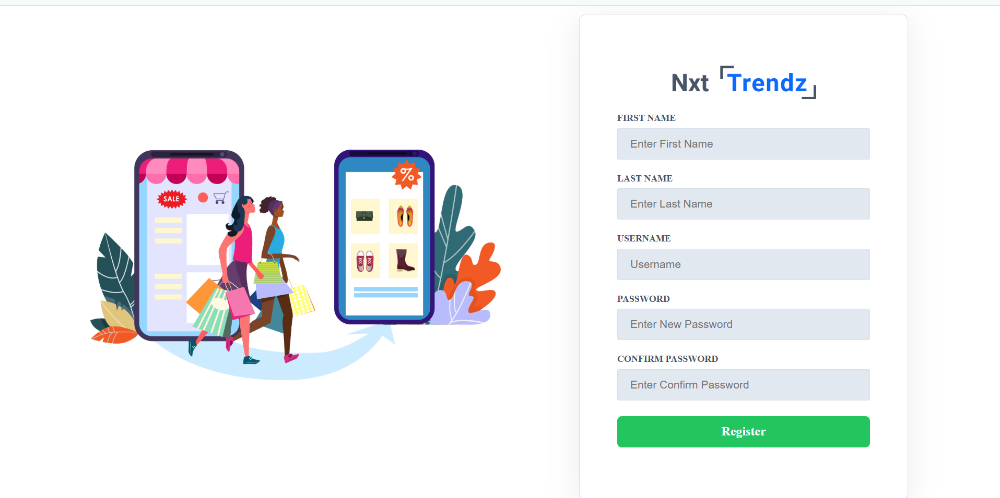
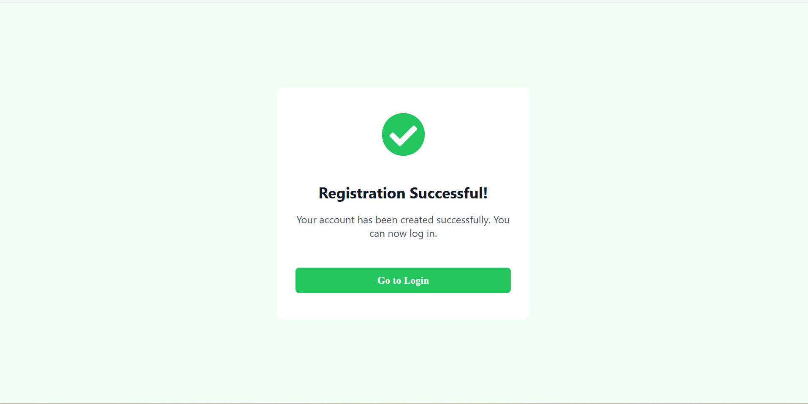

### Login Page
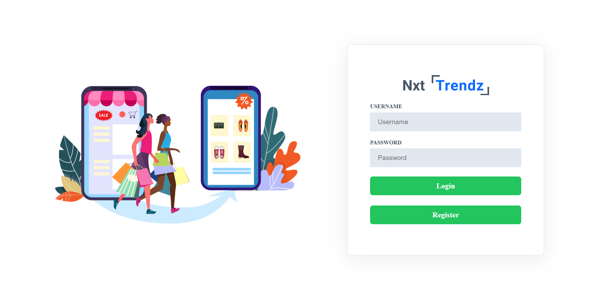

### Home Page
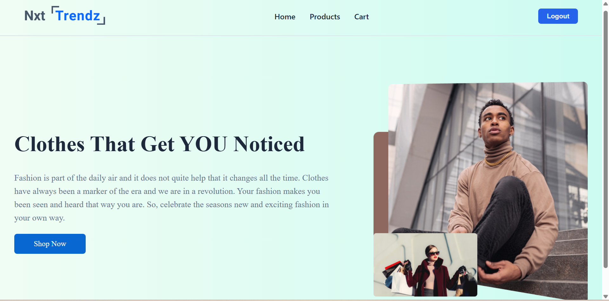

### Products Page
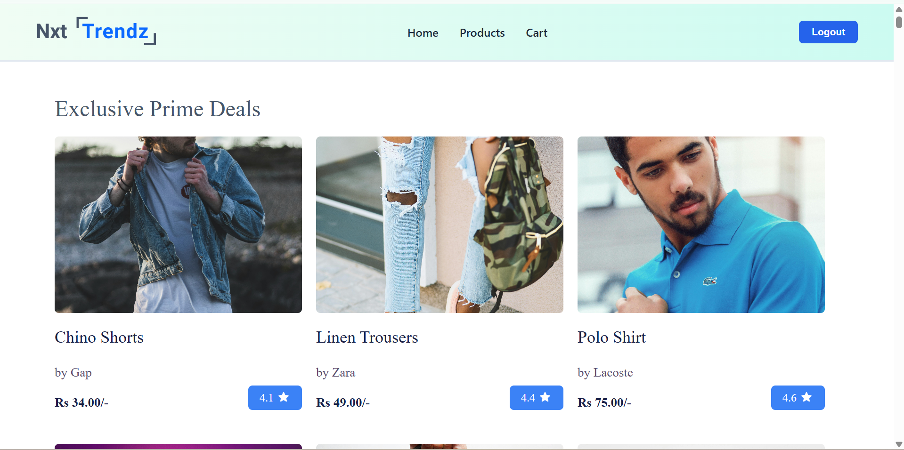
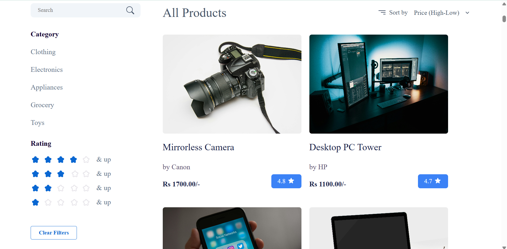

### Products Page (Filters Applied)
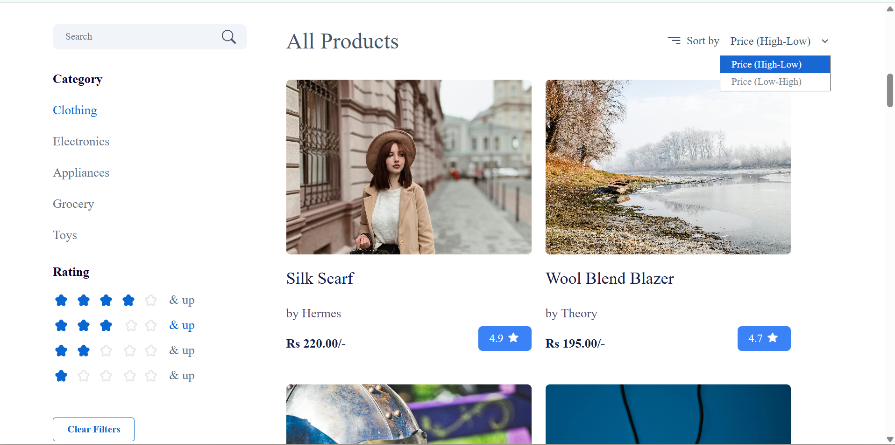
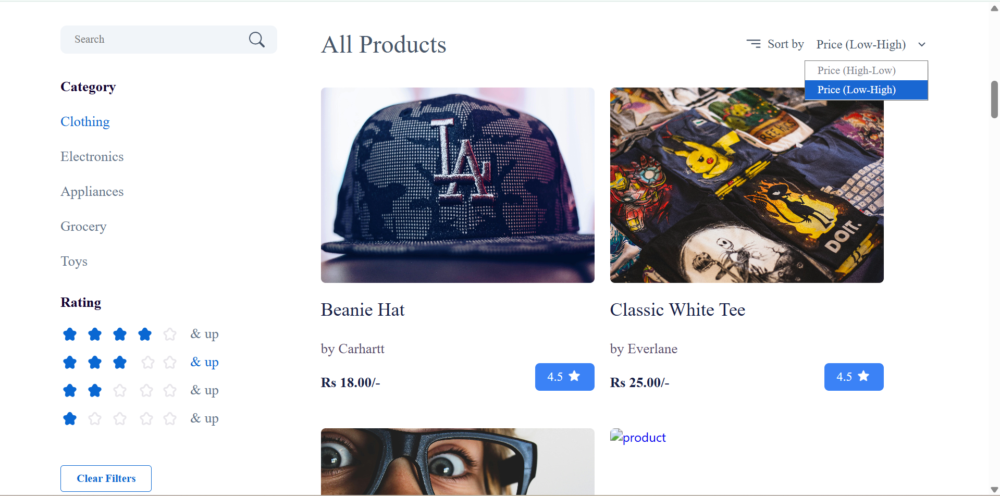
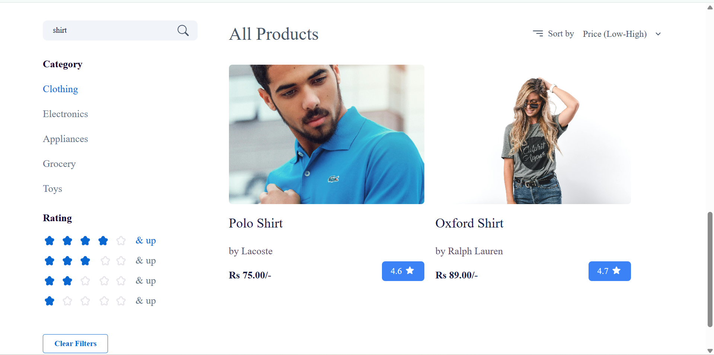

### Product Details Page
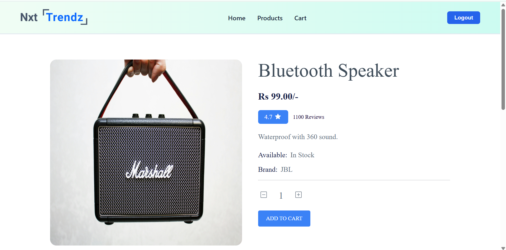
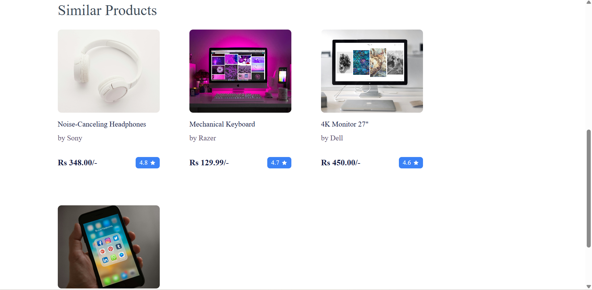

### Product Details (Adding Item to Cart)
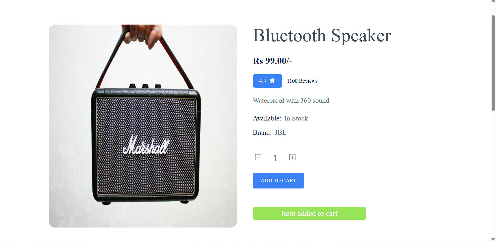

### Product Details (Adding Existing Item to Cart)


### Cart Page
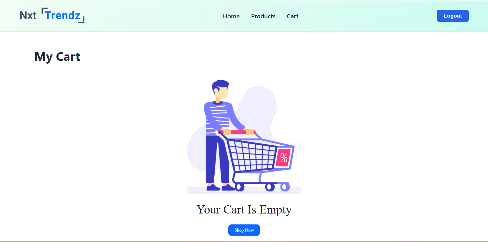
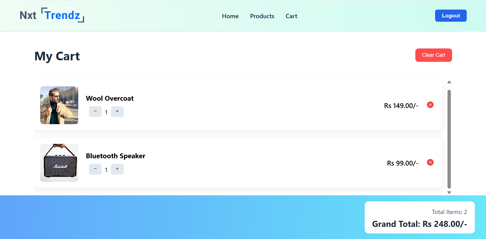

### Cart Page (Update Quantity)
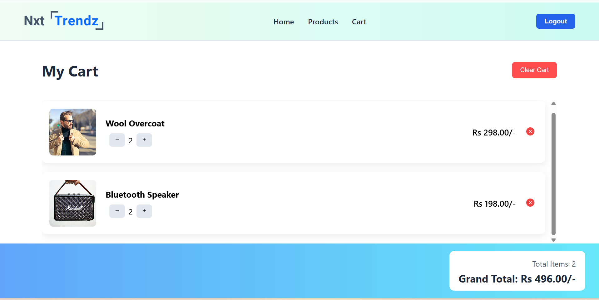

### Cart Page (Remove Item)
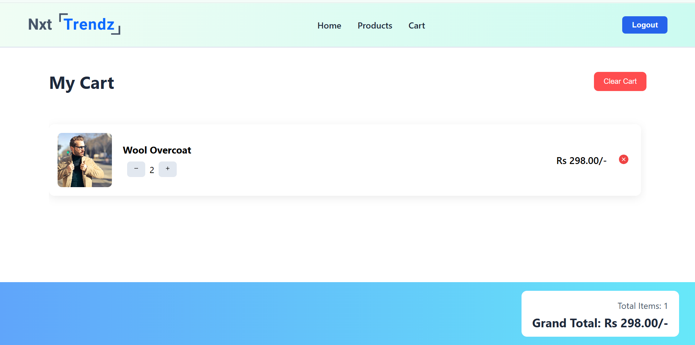

---

# ✨ Features

## Authentication
- User registration
- Secure login with JWT authentication
- Password hashing using bcrypt
- Protected API routes

## Product Browsing
- View all products
- Search products by title
- Filter products by category
- Filter products by rating
- Sort products by price (Low → High / High → Low)

## Product Details
- View detailed product information
- Display similar products

## Shopping Cart
- Add products to cart
- Update product quantity
- Remove items from cart
- Clear entire cart
- Automatic cart total calculation

## Error Handling
- Network error handling using try/catch
- Graceful UI fallback when backend is unavailable

---

# 🧰 Tech Stack

## Frontend
- React.js
- JavaScript (ES6+)
- CSS3
- React Router
- Fetch API
- js-cookie

## Backend
- Node.js
- Express.js
- REST API architecture
- JWT authentication
- bcrypt password hashing

## Database
- MySQL

## Deployment
- Vercel (Frontend)
- Railway (Backend + Database)

---

# 📁 Project Structure

```
E-COMMERCE-APP
│
├── e-commerce-backend
│   │
│   ├── config
│   │   └── db.js
│   │
│   ├── middleware
│   │   └── authMiddleware.js
│   │
│   ├── routes
│   │   ├── authRoutes.js
│   │   ├── productRoutes.js
│   │   └── cartRoutes.js
│   │
│   └── server.js
│
├── e-commerce-frontend
│   │
│   ├── src
│   │   │
│   │   ├── components
│   │   │   ├── AllProductsSection
│   │   │   ├── Cart
│   │   │   ├── CartItem
│   │   │   ├── CartListView
│   │   │   ├── EmptyCartView
│   │   │   ├── FiltersGroup
│   │   │   ├── Header
│   │   │   ├── Home
│   │   │   ├── LoginForm
│   │   │   ├── NotFound
│   │   │   ├── PrimeDealsSection
│   │   │   ├── ProductCard
│   │   │   ├── ProductItemDetails
│   │   │   ├── Products
│   │   │   ├── ProductsHeader
│   │   │   ├── ProtectedRoute
│   │   │   ├── RegisterForm
│   │   │   ├── RegistrationSuccess
│   │   │   └── SimilarProductItem
│   │   │
│   │   ├── App.js
│   │   ├── index.js
│   │   └── index.css
│
├── screenshots
│
└── README.md
```

---

# 🔑 API Endpoints

## Authentication

POST /auth/register  
POST /auth/login  

## Products

GET /products  
GET /products/:id  
GET /prime-deals  

## Cart

POST /api/cart  
GET /api/cart  
PUT /api/cart/:itemId  
DELETE /api/cart/:itemId  
DELETE /api/cart  

---

# ⚙️ Environment Variables

Create a `.env` file in the backend directory.

```
DB_HOST=your_database_host
DB_USER=your_database_user
DB_PASSWORD=your_database_password
DB_NAME=your_database_name

JWT_SECRET=your_secret_key

PORT=your_port
```

---

# ⚙️ Installation

### Clone the repository

```
git clone https://github.com/nagendra-programmer/e-commerce-app.git
```

### Navigate to project folder

```
cd e-commerce-app
```

### Install backend dependencies

```
cd e-commerce-backend
npm install
```

### Install frontend dependencies

```
cd e-commerce-frontend
npm install
```

### Start backend server

```
npm start
```

### Start frontend application

```
npm start
```

---

# 🚧 Future Improvements

- Product pagination
- Wishlist feature
- Order management
- Payment gateway integration
- Admin dashboard

---

# 👨‍💻 Author

Nagendra Katta

GitHub  
https://github.com/nagendra-programmer

---

⭐ If you like this project, consider giving it a star on GitHub!